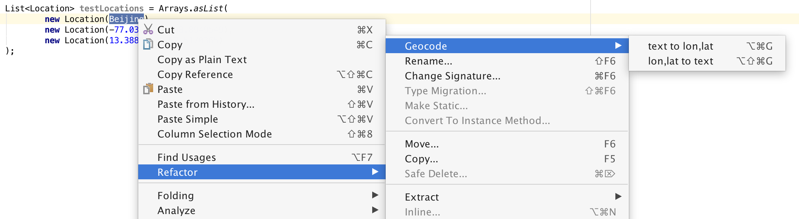
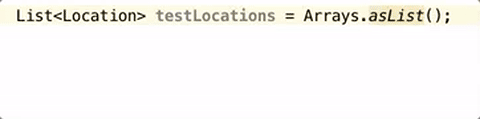

# IntelliJ Geocoding Plugin

This plugin brings useful spatial operations to your editor: you can replaces address names with its coordinates (Geocoding) and vice versa (Reverse Geocoding).
It makes it easy to generate test data or resolve coordinates to its location names within your IntelliJ Editor.

After installing it you have a new action _Refactoring_ group called _Geocoding_

Shortcuts:

* `Alt + Cmd + G` for geocoding
* `Shift + Alt + Cmd + G` for reverse geocoding
 

## Install

### via IntelliJ Plugin Repository

1. go to _Preferences_ (⌘,)
2. in _Plugins_ search for "Geocoding"
3. select _Search in repositories_
4. there you should find the _Geocoding Plugin_

### via JAR file

1. clone
2. `gradle test buildPlugin`
3. go to _Preferences_ (⌘,) 
4. in _Plugins_ click on _Install plugin from disk_ 
5. select the generated jar file under _build/distributions/_

## Run from scratch

1. clone
2. `gradle test runIdea`

## Worth a read

* Basic IntelliJ plugin setup: http://bjorn.tipling.com/how-to-make-an-intellij-idea-plugin-in-30-minutes
* IntelliJ plugin with Gradle: http://www.jetbrains.org/intellij/sdk/docs/tutorials/build_system/prerequisites.html
* Replace selected text: http://www.jetbrains.org/intellij/sdk/docs/tutorials/editor_basics/working_with_text.html
* Sample query with Nominatim: http://www.matyasdanter.com/2012/04/openstreetmap-json-geolocation-using-java/