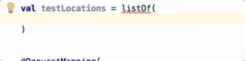
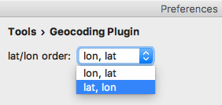

  

# IntelliJ Geocoding Plugin

https://plugins.jetbrains.com/plugin/9235

This Plugin is made for engineers working with Location-Based-Services / -Applications 
Thus you can replace address names by its coordinates (Geocoding) and vice versa (Reverse Geocoding).
It enables you to create test-locations quickly and resolve coordinates to its addresses within your IntelliJ Editor.

After you installed it you have a new action group **Geocode** inside your **Refactoring** context menu.

### Geocoding Shortcuts

* `⌥⌘G` for geocoding
* `⇧⌥⌘G` for reverse geocoding

### Geocoding Context Menu

### Create Sample Data Demo

### Reverse Geocoding Demo

### Geocoding Plugin Preferences

## Install Plugin into your IntelliJ

### via IntelliJ Plugin Repository (WORK IN PROGRESS!)

1. in your IntelliJ go to _Preferences_ `⌘,`
2. in _Plugins_ search for "Geocoding Plugin"
3. select _Search in repositories_
4. there you should find the _Geocoding Plugin_
5. restart IntelliJ

### via JAR file

1. clone this Repo
2. `gradle test buildPlugin`
3. in your IntelliJ go to _Preferences_ `⌘,` 
4. in _Plugins_ click on _Install plugin from disk_ 
5. select the generated jar file under _build/distributions/_
6. restart IntelliJ

## Run from scratch

1. clone this Repo
2. modify code (optional :smirk:) 
2. `gradle test runIdea`

## Troubleshooting

If the shortcuts `⌥⌘G` or `⇧⌥⌘G` don't work in your IntelliJ, they might overlap with other plugins. 
This is how you can fix this issue: 

1. go to _Preferences_ `⌘,`
2. select _Keymap_
3. select the _Find Actions by Shortcut_ icon in the upper-right corner and fire the shortcut
4. modify the overlapping shortcuts to your personal solution

## License

* Source Code [Apache 2.0](LICENSE)
* Geocoded data is provided under the [ODbL](http://opendatacommons.org/licenses/odbl/) via Nominatim / OpenStreetMap®

## Worth a read about IntelliJ Plugin Development

* Basic IntelliJ plugin setup: http://bjorn.tipling.com/how-to-make-an-intellij-idea-plugin-in-30-minutes
* IntelliJ plugin with Gradle: http://www.jetbrains.org/intellij/sdk/docs/tutorials/build_system/prerequisites.html
* Replace selected text: http://www.jetbrains.org/intellij/sdk/docs/tutorials/editor_basics/working_with_text.html
* Sample query with Nominatim: http://www.matyasdanter.com/2012/04/openstreetmap-json-geolocation-using-java/